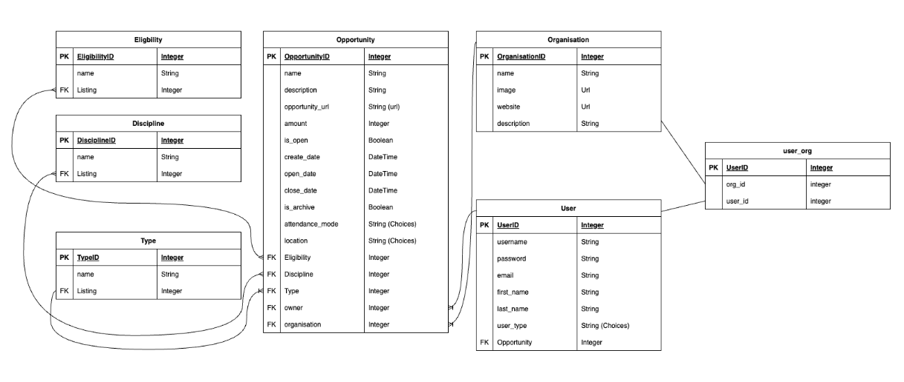
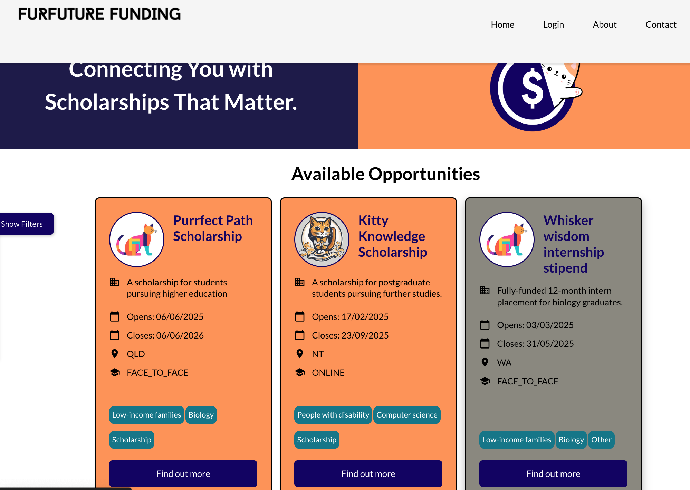
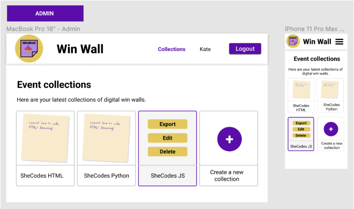
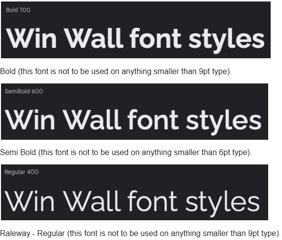

# Fur Future Funding
> THE RAMCATS

## Table of Contents

- [Fur Future Funding](#fur-future-funding)
  - [Table of Contents](#table-of-contents)
  - [Mission Statement](#mission-statement)
  - [Features](#features)
    - [Summary](#summary)
    - [Users](#users)
    - [Opportunity cards](#opportunity-cards)
    - [Opportunity listing](#opportunity-listing)
    - [Pages/Endpoint Functionality](#pagesendpoint-functionality)
    - [Nice To Haves](#nice-to-haves)
  - [Technical Implementation](#technical-implementation)
    - [Back-End](#back-end)
    - [Front-End](#front-end)
    - [Git \& Deployment](#git--deployment)
  - [Target Audience](#target-audience)
    - [Organisations](#organisations)
    - [Potential applicants](#potential-applicants)
  - [Back-end Implementation](#back-end-implementation)
    - [API Specification](#api-specification)
    - [Object Definitions](#object-definitions)
      - [User](#user)
      - [Organisation](#organisation)
      - [Opportunity](#opportunity)
      - [Eligibility](#eligibility)
      - [Discipline](#discipline)
      - [Type](#type)
    - [Database Schema](#database-schema)
  - [Front-end Implementation](#front-end-implementation)
    - [Wireframes](#wireframes)
      - [Home Page](#home-page)
      - [Collection List Page](#collection-list-page)
    - [Logo](#logo)
    - [Colours](#colours)
      - [Primary](#primary)
      - [Secondary](#secondary)
    - [Font](#font)

## Mission Statement

> [!NOTE]  
> What is the purpose of your project? (approx 100-200 words). Example below.


Fur Future Funding is a directory where organisations can list scholarship opportunities specifically targeted to people from diverse or disadvantaged backgrounds. 
Consolidating all opportunities in the one directory benefits both the organisations and potential applicants, connecting the right people to the right opportunity at the right time.
Scholarship and training providers often have small budgets and limited reach. Fur Future Funding will help boost their profile and provide a no-cost option for advertising.
Potential applicants can view, sort and filter hundreds of opportunities to create individualised views, saving time and effort to allow more time to apply for potential opportunities. 

> [!NOTE]  
> Add additional features…


## Features

> [!NOTE]  
> Tell me the features your website will and will not have. Give detailed explanations, this is where you define the scope of your project. Example below.


### Summary 
The directory will enable Guest users to:
- view, sort and filter **opportunity cards** based on multiple criteria, and
- view additional details on the opportunity by selecting an opportunity card

Opportunity cards provide basic information about the opportunity e.g. title, closing date and ??

Authenticated users associated with an organisation (user (organisation)) can:
- create new opportunity listings,
- update existing listings they created, and
- archive listings they created.

Profile page for users (organisation) TBC

All authenticated users can (TBC based on what features we implement)

Admin access ???

### Users

| Type               | Access                                                                                                                                                                                                                                                                                             | Role type assignment                                |
| :----------------- | :------------------------------------------------------------------------------------------------------------------------------------------------------------------------------------------------------------------------------------------------------------------------------------------------- | :-------------------------------------------------- |
| Superuser or admin | <br> - Can log in  <br> - Can log out  <br> - Edit Discipline areas <br> - Edit scholarship Type <br> - Edit scholarship Eligibility <br> - Archive opportunities  <br> - Hide opportunities  <br> - Deactivate users (organisation)  <br> - Export directory data as CSV  <br> - Can see and edit their details via profile page | Site owner(s)                                                |
| User (Organisation)           | <br> - Can log in  <br> - Can log out  <br> - Create, edit and archive opportunities  <br> - Can view and edit their details via profile page                                                                                                                                                              | Users associated with an organisation e.g. administrator, marketing coordinator etc            |
| Guest user             | <br> - View, filter and sort opportunity cards <br> - View opportunity details                                                                                                                              | Public: Users who visit website |

### Opportunity cards

Opportunity cards are automatically generated when a new listing is created. They appear on the front page of the directory and provide the access point for the user to discover more information on the opportunity.

| Feature |Access  | Notes/Conditions |
| :--------------------------------------------- | :--------------------------------------------------------------------------------------------------------------------------------------------------------------------------------------------------------------- | :------------------------------------------------------------------------------------------------------------ |
| View | Can be viewed by anyone visiting the website | <br> - Opportunity cards fixed format and cannot be edited by user <br> - Default view order is by closing date descending  <br> - Default view excludes closed opportunities
| Sort  | Can be done by anyone visiting the website | <br> - Reverse default sort order (closing date descending)  <br> - Change sort order to date opportunity listed (ascending and descending)
| Filter                                           | Can be done by anyone visiting the website                                                                                       |  <br> - Filter by eligibility type <br> - Filter by location <br> - Filter by multiple filters 
| Post                                           | Post as logged in user (organisation)                                                                                                                                                                                                   | <br> - Submit new opportunity listing to create opportunity card |

### Opportunity listing

| Feature                                        | Access                                                                                                                                                                                                           | Notes/Conditions                                                                                              |
| :--------------------------------------------- | :--------------------------------------------------------------------------------------------------------------------------------------------------------------------------------------------------------------- | :------------------------------------------------------------------------------------------------------------ |
| View                                         | Can be viewed by anyone visiting the website  | <br> - Opportunity listing fixed format and cannot be edited by user <br> - Opportunity listing can only be accessed via opportunity card  |
| Post  | Post as logged in user (organisation)  | <br> - Submit new opportunity listing to create an opportunity listing view <br> - Some fields are mandatory <br> Organisation details |
| Edit  | Edit as logged in user (organisation) | <br> - Logged in user must be owner of opportunity listing <br> - Some fields are not editable **list** <br> - Organisation details cannot be edited from the opportunity listing |


### Pages/Endpoint Functionality

| Endpoint              | functionality                                                                                                                                                                     | comments                                                                                         |
| :-------------------- | :-------------------------------------------------------------------------------------------------------------------------------------------------------------------------------- | :----------------------------------------------------------------------------------------------- |
| Home page | <br> - Visible to all users  <br> - Automatically updates when new opportunity added or removed  <br> - Options to sort and filter displayed cards | <br> - Developed as ‘mobile first’  <br> - Easy to read and accessible  <br> - Good contrast |
| Opportunity card | <br> - Visible to all users  <br> - Provides access to opportunity details page | <br> - Content updated if owner updates details <br> - Closed opportunities do not display | 
| Create opportunity page | <br> - Only visible to logged in users associated with an organisation   <br> - Save form to create new opportunity listing                                                                                           | <br> - Developed as ‘desktop first’  <br> Requires authentication |
| View opportunity details page         | <br> - Displays all opportunity details  <br> - Displays associated organisation’s details | <br> - Can only be accessed via opportunity card (i.e. not visible in site architecture)                                      |
| Profile page          | <br> - All registered users  <br> - Can view their personal info  <br> - Can update their info                                                                                    | Requires auth                                                                                    |

### Nice To Haves

- TBC

## Technical Implementation

> [!NOTE]  
> What languages and frameworks will you be using? What kind of database will you be using? How will you deploy the website? Example Below.

### Back-End

- Django / DRF API
- Python

### Front-End

- React / JavaScript
- HTML/CSS

### Git & Deployment

- Heroku
- Netlify
- GitHub

This application's back-end will be deployed to Heroku. The front-end will be deployed separately to Netlify.
 
We will also use Insomnia to ensure API endpoints are working smoothly (we will utilise a local and deployed environment in Insomnia).

## Target Audience

> [!NOTE]  
> Who is the website for? (approx 100 words). Example below.

This website has two major target audiences: Organisations looking to list opportunities on the website and Potential applicants looking for scholarship opportunities.

### Organisations

Organisation administrators will use the website to create new opportunity listings on the site. The administrators will then be able to edit an opportunity to update the status of the opportunity e.g. change open or closing date. 
TBC if we get profile created

### Potential applicants

General public will use this website to view scholarships opportunities that might be available to them. Potential applicants will not need to log in to view, sort and filter potential opportunities.
TBC if we get profile created

## Back-end Implementation

### API Specification

Public website

| HTTP Method | URL  |Purpose  | Request Body | Successful Response Code | Authentication and Authorization                      |
| :---------- | :---------------------------------- | :--------------------------------------------------------------------------------------------------------------------------------------- | :----------------------------------------------------------------------------------------------------------------- | :----------------------- | :---------------------------------------------------- |
| POST | /api-token-auth | Allow users to log in | <br> “Username”: “string” <br> “Password”: “String” | 200 | Account owner |
| GET | /users | Get a list of all users | | 200 | Admin |
| POST | /users | Create new account for nonprofit | <br> "username": "string", "password": "string", "email": "string", "first_name": "string", "last_name": "string", "organisation": { "name": "Tech Innovators Ltd.", "image": "https://example.com/logo.png", "website": "https://techinnovators.com", "description": "A leading tech solutions provider." }, "user_type": "Organisation"   | 201 | None |
| GET | /users/id | Get the details of a user account, their associated organisation and their associated opportunities | | 200 | None |
| PUT | /users/id | Edit the details of a user account | “selected_field_to_update”:”updated_info” | 201 | Account owner |
| DELETE | /users/id | Delete a user account | 204 | Admin |
| POST | /opportunities | Create a new opportunity | "title": "string", "description": "string.", "listing_url": "string", "amount": int, "close_date": "DateTime", "study_mode": "string", "location": "string", "status": "boolean", "eligibility": int (FK), "discipline": int (FK) , "type": int (FK) | 201 | User with an account (Account Owner)
| GET | /opportunities | Returns all opportunities | | 200 | All |
| GET | /opportunities/id | Returns a scholarship listing <br> Can filter by discipline, location, study_field, close_date, in_person or online | Returns request body | 200 | All |
| PUT | /opportunities/id | Update the details of an opportunity e.g. archiving | “selected_field_to_update”:”updated_info” | 201 | Opportunity owner |
| GET | /eligibilities| Get all the available eligibilities | | 200 | None |
| POST | /eligibilities | Create a new eligibility | “name”:” string” | 201 | Admin |
| GET | /eligibilities/id | View the info of one eligibility criteria | | 200 | Admin |
| PUT | /eligibilities/id | Update an eligibility | “name”:”string” | 201 | Admin |
| DELETE | /eligibilities/id | Delete an eligibility | | 204 | Admin |
| GET | /disciplines | Get all the available disciplines | | 200 | None |
| POST | /disciplines | Create a new discipline | “name”:” string” | 201 |Admin |
| GET | /disciplines/id | View the info on one discipline | | 200 | Admin |
| PUT | /disciplines/id | Update a discipline | “name”:”string” | 201 | Admin |
| DELETE | /disciplines/id | Delete a discipline | | 204 | Admin |
| GET | /types | Get all the available scholarship types | | 200 | None |
| POST | /types | Create a new scholarship type | “name”:” string” | 201 | Admin |
| GET | /types/id | View the info of one scholarship type | | 200 | Admin |
| PUT | /types/id | Update a  scholarship type | “name”:”string” | 201 | Admin |
| DELETE | /types/id | Delete  a  scholarship type | | 204 | Admin |


                                        |


### Object Definitions

> [!NOTE]  
> Define the actual objects that your API returns. The example GET method above says it returns “all projects”, so we need to define what a “project” looks like. Example below.

#### User

| Field              | Data type |
| :----------------- | :-------- |
| *UserID (PK)*    |           |
| *username*         | String    |
| *password*         | String    |
| *email*            | String    |
| first_name           | String    |
| last_name | String |
| user_type | String (Choices) |
| Opportunity (FK)    | Integer  |

#### Organisation

| Field              | Data type |
| :----------------- | :-------- |
| *OrganisationID (PK)*    |           |
| name | String |
| image | URL |
| website | URL |
| description | String |

#### Opportunity

| Field              | Data type |
| :----------------- | :-------- |
| *OpportunityID (PK)*    |           |
| name | String |
| description | String |
| opportunity_url | URL |
| amount | Integer |
| is_open | Boolean |
| create_date | DateTime |
| open_date | DateTime |
| close_date | DateTime |
| is_archive | Boolean |
| attendance_mode | String (Choices) |
| location | String (Choices) |
| Eligibility (FK) | Integer |
| Discipline (FK) | Integer |
| Type (FK) | Integer |
| owner (FK) | Integer |
| organisation (FK) | Integer |

#### Eligibility

| Field              | Data type |
| :----------------- | :-------- |
| *EligibilityID (PK)*    |           |
| name | String |
| Opportunity (FK ) | Integer |

#### Discipline

| Field              | Data type |
| :----------------- | :-------- |
| *DisciplineID (PK)*    |           |
| name | String |
| Opportunity (FK ) | Integer |


#### Type

| Field              | Data type |
| :----------------- | :-------- |
| *TypeID (PK)*    |           |
| name | String |
| Opportunity (FK ) | Integer |


> [!NOTE]  
> ... etc

### Database Schema

> [!NOTE]  
> Insert an image of your database schema (could be a photo of a hand-drawn schema or a screenshot of a schema created using a tool such as ​​https://drawsql.app/). Example below.



## Front-end Implementation

### Wireframes

> [!NOTE]  
> Insert image(s) of your wireframes (could be a photo of hand-drawn wireframes or a screenshot of wireframes created using a tool such as https://www.mockflow.com/).

See all wireframes and how Admins, Approvers and Students would see the Win Wall website: https://www.figma.com/file/cvP0Kc7lAX39Fvo12C5aLa/Win-Wall?node-id=22%3A1345 

#### Home Page



#### Collection List Page



> [!NOTE]  
> etc...

### Logo


### Colours

#### Primary


#### Secondary


### Font

(We will create a ‘highlight-text’ font style in CSS with the glow effect as per the above - to use on hero section)
Raleway
Google fonts:

```css
@import url('https://fonts.googleapis.com/css2?family=Raleway:wght@400;600;700&display=swap');
font-family: 'Raleway', sans-serif;
```
(When Raleway is not available the standard font to be used is the Calibri font family)



