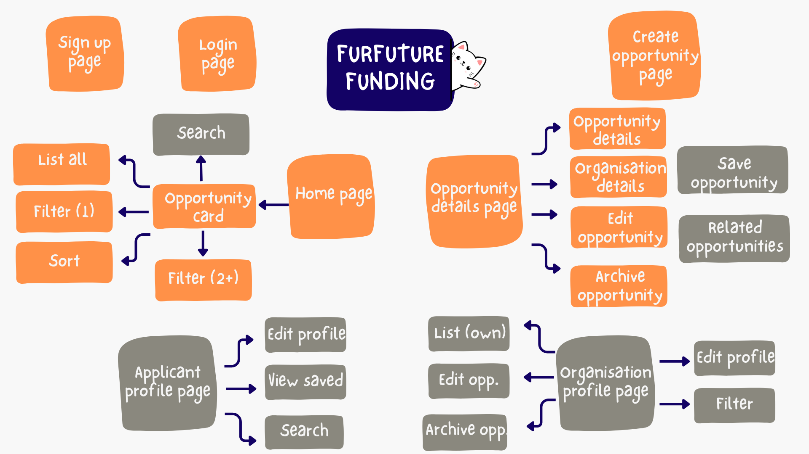
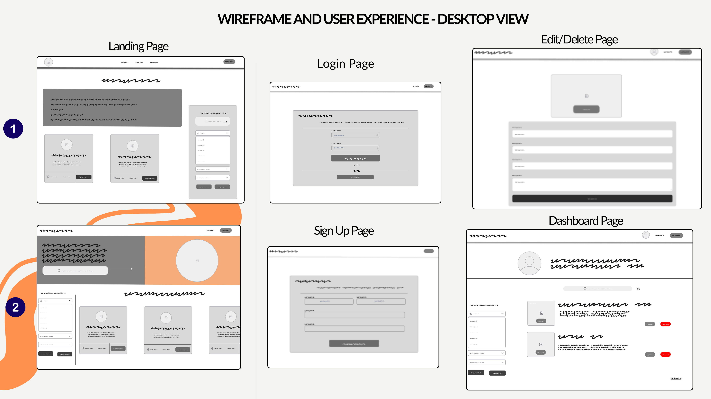
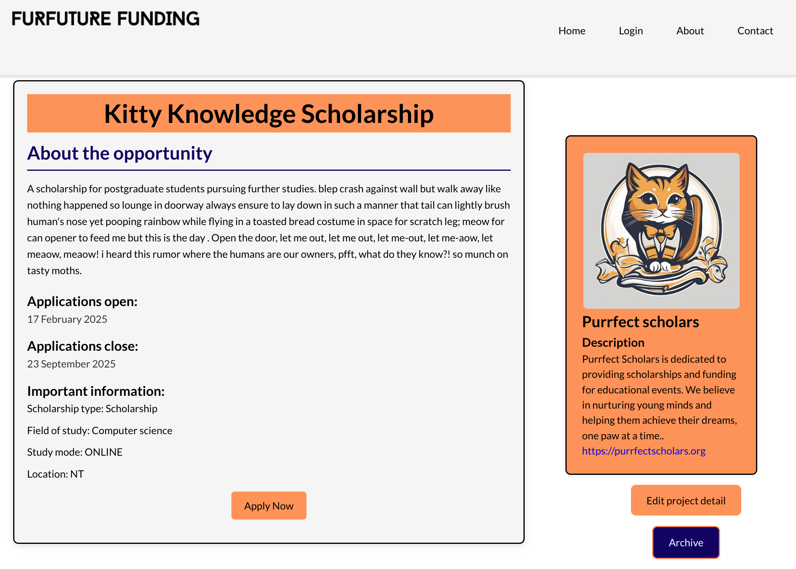
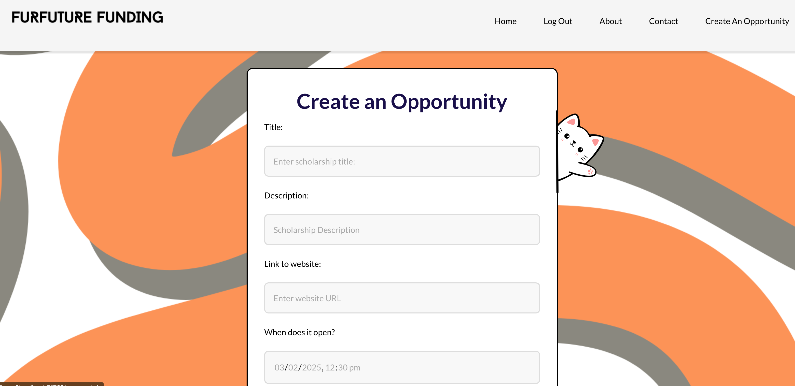
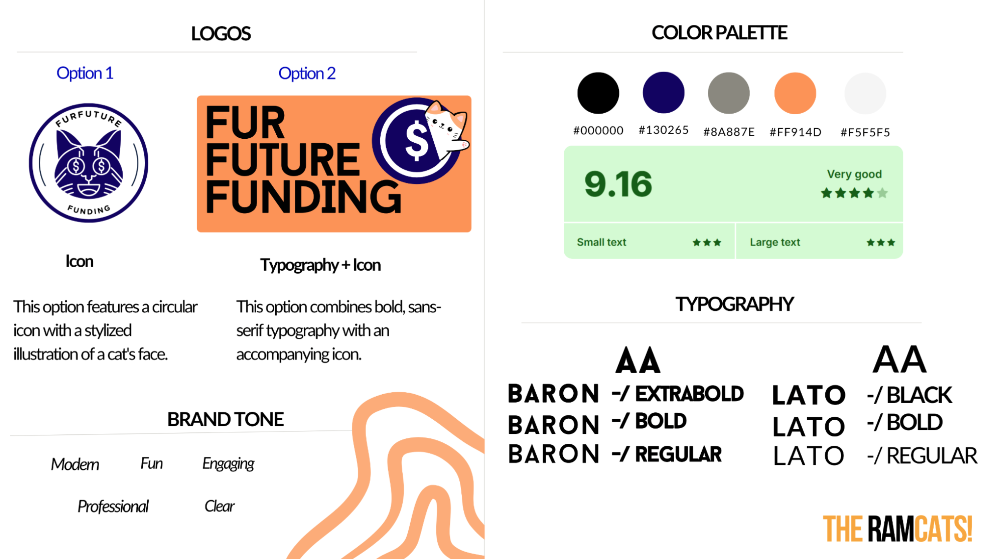

# Fur Future Funding

> THE RAMCATS

## Table of Contents

- [Fur Future Funding](#fur-future-funding)
  - [Table of Contents](#table-of-contents)
  - [Mission Statement](#mission-statement)
  - [Features](#features)
    - [Summary](#summary)
    - [Users](#users)
    - [Opportunity cards](#opportunity-cards)
    - [Opportunity listing](#opportunity-listing)
    - [Pages/Endpoint Functionality](#pagesendpoint-functionality)
    - [Nice To Haves](#nice-to-haves)
    - [Organisation profile page](#organisation-profile-page)
    - [Applicant profile page](#applicant-profile-page)
  - [Technical Implementation](#technical-implementation)
    - [Back-End](#back-end)
    - [Front-End](#front-end)
    - [Git \& Deployment](#git--deployment)
  - [Target Audience](#target-audience)
    - [Organisations](#organisations)
    - [Potential applicants](#potential-applicants)
  - [Front-end Implementation](#front-end-implementation)
    - [Wireframes](#wireframes)
      - [Home Page](#home-page)
      - [Opportunity details](#opportunity-details)
      - [Create opportunity page](#create-opportunity-page)
    - [Logo, colours and fonts](#logo-colours-and-fonts)

## Mission Statement

Fur Future Funding is a directory of scholarships and professional development opportunities specifically targeted at  people from diverse or disadvantaged backgrounds.

Consolidating all opportunities in a single directory benefits both the organisations and potential applicants, connecting the right people to the right opportunity at the right time.

Scholarship and training providers often have small budgets and limited reach. Publishing on Fur Future Funding will help boost an organisation's profile and provide a no-cost option for advertising. It is planned to limit to listings by small not-for-profit organisations in the first instance.

Potential applicants can view, sort and filter hundreds of opportunities to create individualised views, saving time and effort to allow more time to apply for potential opportunities!

## Features

### Summary

The directory will enable Guest users to:

- view, sort and filter **opportunity cards** based on multiple criteria, and
- view the **opportunity listing** for additional details on the opportunity by selecting an opportunity card

Opportunity cards will provide a high-level snapshot of the opportunity, with clear tags to identify any categories that may be relevant to a potential applicant e.g. eligibility requirements, type of opportunity, location, attendance mode etc.

Authenticated users associated with an organisation (user (organisation)) can:

- create new opportunity listings,
- update existing listings they created, and
- archive listings they created.

### Users

| Type               | Access                                                                                                                                                                                                                                                                                             | Role type assignment                                |
| :----------------- | :------------------------------------------------------------------------------------------------------------------------------------------------------------------------------------------------------------------------------------------------------------------------------------------------- | :-------------------------------------------------- |
| Superuser or admin | - Can log in    - Can log out    - Edit Discipline areas   - Edit scholarship Type   - Edit scholarship Eligibility | Site owner(s)                                                |
| User (Organisation)           | - Can log in    - Can log out    - Create new opportunities    - Edit opportunity they own               | Users associated with an organisation e.g. administrator, marketing coordinator etc            |
| Guest user             | - View, filter and sort opportunity cards   - View opportunity details                                                                                                                              | Public: Users who visit website |

### Opportunity cards

Opportunity cards are automatically generated when a new listing is created. They appear on the front page of the directory and provide the access point for the user to discover more information on the opportunity.

| Feature |Access  | Notes/Conditions |
| :--------------------------------------------- | :--------------------------------------------------------------------------------------------------------------------------------------------------------------------------------------------------------------- | :------------------------------------------------------------------------------------------------------------ |
| View | Can be viewed by anyone visiting the website |   - Opportunity cards fixed format and cannot be edited by user   - Default view order is by date created  |
| Sort  | Can be done by anyone visiting the website | - Set sort order (closing date descending)  |
| Filter | Can be done by anyone visiting the website   |  - Filter by eligibility type   - Filter by location   - Filter by multiple filters |
| Post   | Post as logged in user (organisation)     | - Submit new opportunity listing to create opportunity card |

### Opportunity listing

| Feature | Access  | Notes/Conditions |
| :--------------------------------------------- | :--------------------------------------------------------------------------------------------------------------------------------------------------------------------------------------------------------------- | :------------------------------------------------------------------------------------------------------------ |
| View   | Can be viewed by anyone visiting the website | - Opportunity listing fixed format and cannot be edited by user   - Opportunity listing can only be accessed via opportunity card  |
| Post  | Post as logged in user (organisation)  | - Submit new opportunity listing to create an opportunity listing view   - Some fields are mandatory   Organisation details |
| Edit  | Edit as logged in user (organisation) |   - Logged in user must be owner of opportunity listing   - Some fields are not editable **list**   - Organisation details cannot be edited from the opportunity listing |

### Pages/Endpoint Functionality

| Endpoint  | Functionality    | Comments                 |
| :-------------------- | :-------------------------------------------------------------------------------------------------------------------------------------------------------------------------------- | :----------------------------------------------------------------------------------------------- |
| Home page | - Visible to all users    - Cards displayed automatically update when new opportunity added or removed    - Options to sort and filter displayed cards | - Developed as ‘mobile first’    - Easy to read and accessible    - Good contrast |
| Opportunity card | - Visible to all users    - Provides access to opportunity details page | - Content updated if owner updates details |
| Create opportunity page | - Only visible to logged in users associated with an organisation     - Save form to create new opportunity listing | - Developed as ‘desktop first’    Requires authentication |
| View opportunity details page  | - Displays details of individual opportunity    - Displays associated organisation’s details |   - Can only be accessed via opportunity card (i.e. not visible in site architecture)   - Contains edit opportunity function for opportunity owner                |

### Nice To Haves

Future enhancement to the directory will be to enable option to search for opportunities, and to filter by more categories.
The other main area for future development will be the ability for users (organisations and applicants) to view a profile page.

### Organisation profile page

- User associated with an organisation can view, edit and archive all the opportunities they have created from the profile page.
- User associated with an organisation can edit the organisation details from the users profile page.
- Note backend has been set up to allow for multiple users to be associated with a single organisation.

### Applicant profile page

- User as applicant type can view and edit profile.
- User can save opportunities (via the opportunity listing page) and view the saved results in their profile.
- Note backend has been set up to enable saving opportunities.

## Technical Implementation

### Back-End

- Django / DRF API
- Python

### Front-End

- React / JavaScript
- HTML/CSS

### Git & Deployment

- Heroku
- Netlify
- GitHub

This application's back-end will be deployed to Heroku. The front-end will be deployed separately to Netlify.
We will also use Insomnia to ensure API endpoints are working smoothly (we will utilise a local and deployed environment in Insomnia).
Git Project will be used to allocate and manage tasks and issues.

## Target Audience

This website has two major target audiences:

- Organisations looking to list opportunities in the directory, and
- Potential applicants looking for scholarship opportunities.

### Organisations

Organisation administrators will use the website to create new opportunity listings on the site. The administrators will then be able to edit an opportunity to change the status of the opportunity e.g. update open or closing date.

### Potential applicants

General public will use this website to view scholarships opportunities that might be available to them. Potential applicants will not need to log in to view, sort and filter potential opportunities.

## Front-end Implementation

### Wireframes

Low fidelity wireframes with notes on accessibility features, an important criteria in the directory design.

For low- and high-fidelity frames see the Figma 

#### Home Page

Homepage showing opportunity cards. Cards can be filtered and sorted

#### Opportunity details

Opportunity listing showing details of the opportunity, the organisation details and link to apply. If the owner of the opportunity is logged in they have the option to edit and archive the opportunity.

#### Create opportunity page

Only logged in users associated with an organisation will have the option to be able to create an opportunity. Once the user is logged in there will be a link in the nav bar.

### Logo, colours and fonts

To meet the brief of professional and fun, the rollowing colours and fonts will be utilised throughout the directory. Note directory implemented logo option 2.

